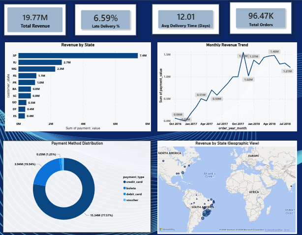
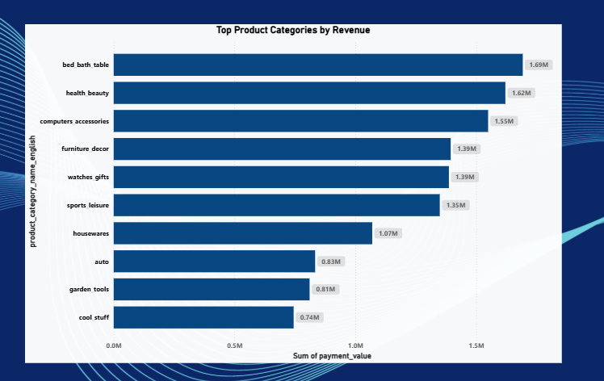
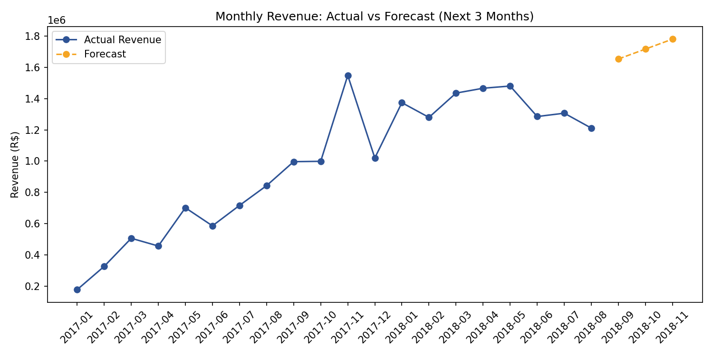

# Olist E-Commerce Sales & Delivery Analytics

End-to-end data analysis project on the Olist Brazilian E-Commerce dataset (2016–2018), covering data cleaning, SQL analysis, and an interactive Power BI dashboard.

## 📊 Project Overview

This project analyzes 96,000+ delivered orders from Olist, a Brazilian multi-vendor e-commerce marketplace. The goal was to uncover insights around revenue trends, delivery performance, payment behavior, and geographic sales distribution.

**Key Insight:** Late deliveries drop average review scores from 4.21 to 2.26 — highlighting a direct link between logistics performance and customer satisfaction.

## 🛠️ Tools Used

- **Python (Pandas)** — data cleaning, merging, and exploratory analysis
- **SQL (SQLite)** — business queries, joins, aggregations
- **Excel** — pivot table summaries (revenue by state, category, payment type)
- **Power BI** — interactive dashboard and visualizations

## 📁 Project Structure

```
├── merge-clean.py         # Merges 9 raw tables into one clean dataset
├── analysis.py             # Revenue, category, and delivery analysis
├── olist-database.py       # Loads cleaned data into SQLite (olist.db)
├── queries.py               # Runs all 10 SQL business queries
├── forecast.py              # Forecasts next 3 months of revenue
├── revenue_forecast.png     # Forecast chart (actual vs predicted)
├── revenue_forecast.csv     # Forecast output data
├── Olist_Analysis.xlsx      # Excel pivot table summaries
├── screenshots/
│   └── dashboard_overview.png   # Final Power BI dashboard
├── LICENSE
└── README.md
```

## 🔑 Key Steps

1. **Data Cleaning & Merging** (`merge-clean.py`) — Combined 9 relational tables (orders, customers, products, sellers, payments, reviews) into a single analysis-ready dataset. Filtered to delivered orders only, removed duplicates, and engineered features like delivery delay and order month.
2. **Python Analysis** (`analysis.py`) — Explored revenue by state, top product categories, monthly trends, delivery delay vs review score correlation, payment type distribution, and top sellers.
3. **SQLite Load** (`olist-database.py`) — Loaded the cleaned dataset into a SQLite database for SQL-based querying.
4. **SQL Business Queries** (`queries.py`) — Ran 10 queries covering state-wise revenue, top categories, delivery performance, repeat customers, and seller concentration using joins, subqueries, and aggregations.
5. **Excel Pivot Tables** (`Olist_Analysis.xlsx`) — Built pivot table summaries for revenue by state, revenue by product category, and payment type distribution, using formulas linked to the raw data so they update automatically.
6. **Power BI Dashboard** — Built an interactive dashboard with KPI cards, a revenue-by-state bar chart, a monthly revenue trend line chart, a payment method donut chart, a geographic revenue map, and a top product categories chart.

## 📈 Dashboard Preview

**Overview** — KPI cards, revenue by state, monthly trend, payment method mix, and geographic revenue map:



**Category Analysis** — top product categories by revenue:



## 🔮 Revenue Forecasting

Used a linear regression model (`forecast.py`) on monthly revenue trend to project the next 3 months of sales.

| Month | Forecasted Revenue |
|---|---|
| Sep 2018 | R$1.65M |
| Oct 2018 | R$1.72M |
| Nov 2018 | R$1.78M |

Model R² Score: 0.789 · Average monthly growth: R$63,644



## 📌 Key Findings

- **Total Revenue:** R$19.77M across 96,470 delivered orders
- **São Paulo (SP)** contributes ~37% of total revenue, far ahead of other states
- **Credit card** is the dominant payment method (77.6% of revenue), reflecting Brazil's strong installment culture
- **Late deliveries** occur in 6.6% of orders and significantly hurt customer satisfaction
- **November 2017** saw a sharp sales spike, likely tied to Black Friday

## 📂 Dataset

[Olist Brazilian E-Commerce Public Dataset](https://www.kaggle.com/datasets/olistbr/brazilian-ecommerce) (Kaggle)

## 🚀 How to Run

1. Clone this repository
2. Download the dataset from the Kaggle link above and place the CSVs in the project folder
3. Run scripts in order:
   ```bash
   python merge-clean.py
   python analysis.py
   python olist-database.py
   python queries.py
   python forecast.py
   ```
4. `Olist_Analysis.xlsx` contains pivot table summaries (revenue by state, category, and payment type) built from the cleaned data
5. The Power BI dashboard (screenshot above) was built in Power BI Desktop using `olist_merged_cleaned.csv` — follow the same KPI cards, bar chart, line chart, donut chart, and map visuals shown in the preview to recreate it

## 👤 Author

Yuvraj Yadav — B.Tech CSE Student, Medicaps University
